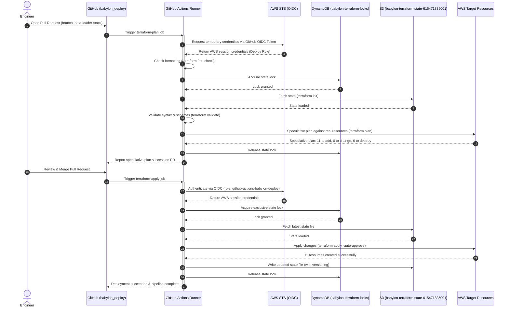

# Architecture Decision Record: Declarative Serverless Infrastructure, Remote State Backend, and GitHub Actions CI/CD Pipeline for Babylon Data Loader

* **Status**: Accepted (Implemented - PR #4 Pending Merge)
* **Author**: Documentation Engineer (`documentation-engineer`)
* **Date**: 2026-10-03
* **Project**: [`babylon_deploy`](../../README.md)
* **Target Components**: [`babylon_deploy/terraform`](../../terraform), [`babylon_deploy/.github/workflows/terraform.yml`](../../.github/workflows/terraform.yml), [`tools/`](../../../tools)
* **Related Specifications**:
  * [`docs/specs/data-loader-serverless-pipeline.md`](./data-loader-serverless-pipeline.md)
  * [`docs/README.md`](../README.md)

---

## 1. Context and Problem Statement

The Babylon 2.0 multi-repository ecosystem ingests raw personal financial transaction statements (CSV files from financial institutions, credit cards, and banking portals) and normalizes them into a centralized MongoDB datalake. In earlier design iterations, infrastructure scaffolding was exploratory and unaligned with the production architecture:

1. **Obsolete Aurora PostgreSQL Scaffold**: The original Terraform module in [`terraform/modules/data-loader`](../../terraform/modules/data-loader) contained an unmaintained Aurora PostgreSQL cluster configuration ("alex-aurora"). Because Babylon's data model is natively built on MongoDB (`go.mongodb.org/mongo-driver`), this placeholder was not only non-functional for the application but, if provisioned, would incur substantial recurring idle costs ($60.00 – $100.00+/month).
2. **Workload Characteristics and Cost Constraints**: Financial statement ingestion is an intermittent, batch-driven workload. CSV statements arrive periodically (e.g., weekly or monthly) or on-demand via the desktop user interface. For >99% of any given calendar month, compute infrastructure sits completely idle. The ecosystem operates under a strict **$0.00 / month baseline idle cost mandate**.
3. **Local State Limitations in Distributed CI/CD**: Terraform state was initially tracked locally on developer workstations via `terraform.tfstate`. Local state management presents fatal limitations:
   * **Ephemeral Runners**: Ephemeral CI/CD runners (such as GitHub Actions) discard local disk storage at the end of each job execution. Storing state locally makes automated planning and applying in CI/CD impossible.
   * **Concurrency Hazards**: Without a centralized distributed lock manager, multiple developers or concurrent CI jobs can execute conflicting plans and applies simultaneously, risking state corruption and resource collisions.
   * **Auditability & Drift**: Infrastructure applied locally bypasses centralized pull request reviews, lacks tamper-proof audit trails, and increases configuration drift between local machines and cloud reality.
4. **Credential Security & Operational Decoupling**: Managing cloud infrastructure manually via long-lived IAM user access keys poses severe credential leakage risks. A modern deployment harness requires short-lived OpenID Connect (OIDC) identity federation and a decoupled release cycle where application container updates do not interfere with infrastructure state.

To address these challenges, we required a declarative, serverless AWS infrastructure foundation, a secure remote state backend with distributed locking, and an automated GitHub Actions CI/CD pipeline.

---

## 2. Decision Drivers

The architectural decisions for the Babylon Data Loader infrastructure and delivery pipeline are governed by six primary drivers:

1. **Zero Baseline Cost ($0.00 / month)**:
   * Compute must scale to absolute zero when idle. Using AWS Lambda on ARM64 Graviton delivers 1,000,000 free requests and 3,200,000 compute-seconds per month under the AWS Free Tier.
   * Storage costs for the Amazon S3 landing bucket are negligible for small CSV files and further minimized via automated archival lifecycles.
   * Remote state storage in Amazon S3 (<1 MB) and state concurrency locking via Amazon DynamoDB (Pay-Per-Request billing mode) remain well within perpetual AWS Free Tier thresholds.
2. **Strict Decoupling of Compute Infrastructure vs. Container Releases**:
   * Compute specifications (memory allocation, execution timeout, S3 trigger notifications, environment bindings, and IAM execution roles) must be declared in Terraform.
   * Container image builds and tags are released independently by the application repository ([`babylon_data_loader`](../../../babylon_data_loader)) CI/CD workflow.
   * Terraform must declare `lifecycle { ignore_changes = [image_uri] }` on the Lambda function resource. This guarantees that running a Terraform apply will never overwrite, roll back, or disrupt container releases deployed by application pipelines.
3. **Zero IAM Role Provisioning in Terraform via Workspace Automation**:
   * To maintain least privilege, prevent privilege escalation, and avoid circular bootstrapping dependencies, Terraform modules must **never** create or mutate IAM roles directly.
   * IAM execution roles (`babylon-data-loader-lambda-role`) and deployment roles (`github-actions-babylon-deploy`) are provisioned once by administrators using standalone workspace scripts in [`tools/`](../../../tools) and reviewed JSON policy templates in [`tools/iam/`](../../../tools/iam).
   * Terraform references these roles exclusively through read-only data sources (`data.aws_iam_role.lambda_execution`, `data.aws_iam_role.github_actions_deploy`).
4. **Persistent Remote State & Distributed Concurrency Locking**:
   * Infrastructure state must reside in a dedicated, secure S3 bucket (`babylon-terraform-state-615471835001`) with Server-Side Encryption (AES256), bucket versioning enabled for point-in-time recovery, and public access completely blocked.
   * Mutual exclusion must be enforced using an Amazon DynamoDB lock table (`babylon-terraform-locks`) with Pay-Per-Request billing, guaranteeing zero concurrent execution conflicts.
5. **Declarative GitHub Actions CI/CD with Strict PR Governance**:
   * Every infrastructure change must undergo automated format verification (`terraform fmt -check`), syntax validation (`terraform validate`), and speculative execution planning (`terraform plan`) on Pull Requests targeting `main`.
   * Production infrastructure mutations must be strictly gated: `terraform apply -auto-approve` executes automatically and exclusively upon merging approved code into `main`.
   * Authentication between GitHub Actions and AWS must use OpenID Connect (OIDC) federation, eliminating static AWS access keys and secret rotation overhead.
6. **Single Environment Standard (Purging the `dev` Moniker)**:
   * Babylon 2.0 adopts a streamlined single-environment cloud model. The redundant `dev` suffix and directory partitioning were purged across secrets, buckets, and Lambda configurations (e.g., secret name `babylon/datalake/credentials`, landing bucket `babylon-datalake-landing-615471835001`).
   * Infrastructure is standardized in `us-west-2` across all core resources.

---

## 3. Considered Options and Trade-Off Analysis

### 3.1 Apply & Deployment Execution: Local CLI Apply vs. GitHub Actions CI/CD

| Criteria | Option A: Local CLI Apply (`terraform apply` on Workstation) | Option B: Declarative GitHub Actions CI/CD (Selected) |
| :--- | :--- | :--- |
| **Execution Environment** | Uncontrolled developer laptop; dependent on local tools and shell environment | Ephemeral, standardized Ubuntu container running pinned Terraform v1.10.0 |
| **Credential Security** | Requires long-lived administrator AWS credentials stored locally on disk | Short-lived, temporary STS credentials via OIDC identity federation |
| **PR Quality Gate** | None; plans are reviewed locally or pasted into chat manually | Automated format check, schema validation, and speculative plan output on PR |
| **Auditability & Traceability** | Low; execution history is scattered across individual engineer machines | High; complete execution logs and Git commit SHA associations preserved in GitHub Actions |
| **Concurrency Protection** | Reliant on manual discipline if locking is omitted | Guaranteed sequential execution via DynamoDB locking and workflow concurrency groups |
| **Decision** | **Rejected**: Incompatible with team collaboration and introduces high security/drift risk | **Selected**: Meets operational governance, security, and automation standards |

### 3.2 IAM Role Management: In-Terraform Provisioning vs. External Workspace Scripts

| Criteria | Option A: Provision IAM Roles Directly in Terraform | Option B: Standalone Workspace Scripts + Terraform Data Sources (Selected) |
| :--- | :--- | :--- |
| **Privilege Separation** | Terraform CI/CD deploy role must possess broad `iam:*` admin permissions | Terraform CI/CD deploy role only requires service-specific permissions; zero `iam:CreateRole` |
| **Bootstrapping Dependency** | Circular dependency: Terraform requires deploy role to run, but deploy role is defined in Terraform | Clean bootstrap: [`tools/setup-terraform-backend.sh`](../../../tools/setup-terraform-backend.sh) and [`tools/setup-lambda-role.sh`](../../../tools/setup-lambda-role.sh) configure foundations |
| **State File Exposure** | IAM trust policies and resource definitions are coupled to Terraform state | IAM configurations are cleanly tracked in [`tools/iam/`](../../../tools/iam) JSON files under version control |
| **Blast Radius** | Accidental `terraform destroy` or configuration errors could destroy active IAM roles | IAM roles remain intact even if compute infrastructure modules are torn down |
| **Decision** | **Rejected**: Violates least-privilege security principle and creates bootstrap chicken-egg cycle | **Selected**: Enforces clear boundary between security administration and compute provisioning |

### 3.3 State Backend: Local Backend vs. Remote S3 Backend + DynamoDB Locks

| Criteria | Option A: Local Backend (`terraform.tfstate`) | Option B: Remote S3 Backend with DynamoDB Locking (Selected) |
| :--- | :--- | :--- |
| **Monthly Cost** | $0.00 | $0.00 (within AWS Free Tier for S3 storage and DynamoDB Pay-Per-Request) |
| **CI/CD Compatibility** | Broken; ephemeral runners lose state immediately upon termination | Seamless; runners pull state on `terraform init` and push updates upon apply |
| **Locking & Concurrency** | Zero concurrency locking; concurrent runs overwrite state | Distributed mutex via DynamoDB lock table prevents simultaneous execution |
| **Durability & Rollback** | Fragile; disk failure or accidental deletion destroys state | High durability (99.999999999%); S3 bucket versioning enables instant state recovery |
| **Encryption at Rest** | Unencrypted on local filesystem unless manually configured | Enforced SSE-S3 AES-256 server-side encryption |
| **Decision** | **Rejected**: Unusable in automated pipelines | **Selected**: Industry-standard robust remote state management |

---

## 4. Decision Outcome

We have accepted and implemented a **Declarative Serverless Infrastructure and CI/CD Architecture** across [`babylon_deploy`](../../README.md) and workspace [`tools/`](../../../tools):

1. **Remote State Backend**:
   * Storage: S3 bucket `babylon-terraform-state-615471835001` in `us-west-2` with SSE-S3 AES-256 encryption, bucket versioning enabled, and public access blocked.
   * Lock Manager: DynamoDB table `babylon-terraform-locks` configured with Pay-Per-Request billing mode and `LockID` hash key.
2. **Modular Infrastructure Provisioning**:
   * **Datalake Module ([`terraform/modules/datalake`](../../terraform/modules/datalake))**: Provisions S3 landing bucket `babylon-datalake-landing-615471835001` with server-side encryption, public access block, TLS 1.2+ transport policy, 30-day Standard-IA transition, and 90-day expiration for `processed/`. Provisions AWS Secrets Manager secret `babylon/datalake/credentials` with initial placeholder configuration and `ignore_changes = [secret_string]`.
   * **Data Loader Module ([`terraform/modules/data-loader`](../../terraform/modules/data-loader))**: Provisions CloudWatch Log Group `/aws/lambda/babylon-data-loader` (14-day retention), AWS Lambda function `babylon-data-loader` (ARM64 Graviton, 512 MB memory, 300s timeout) consuming externally managed IAM role, `aws_lambda_permission.allow_s3`, and S3 bucket notifications triggering on `unprocessed/*.csv` and `unprocessed/*.CSV`.
   * **ECR Integration ([`terraform/modules/ecr`](../../terraform/modules/ecr))**: Wires shared container registry `ajp/babylon` and GitHub Actions deployment role via read-only Terraform data sources.
3. **Container Decoupling Contract**:
   * `lifecycle { ignore_changes = [image_uri] }` is strictly enforced on `aws_lambda_function.data_loader`, decoupling application container deployments from infrastructure management.
4. **Declarative GitHub Actions CI/CD Pipeline**:
   * Workflow [`.github/workflows/terraform.yml`](../../.github/workflows/terraform.yml) authenticates to AWS via OIDC role `arn:aws:iam::615471835001:role/github-actions-babylon-deploy`.
   * Automated speculative planning on PRs targeting `main`.
   * Automated `terraform apply -auto-approve` upon push or merge to `main`.

---

## 5. Architectural Design and Flow Diagrams

### 5.1 System Architecture Diagram

```mermaid
flowchart TD
    subgraph Local["Workspace Tools & Administration"]
        Admin["Administrator / Engineer"] -->|Executes once| ToolBackend["tools/setup-terraform-backend.sh"]
        Admin -->|Executes once| ToolRole["tools/setup-lambda-role.sh"]
        ToolBackend -->|Provisions| S3State["S3 State Bucket<br/>(babylon-terraform-state-615471835001)"]
        ToolBackend -->|Provisions| DDBLock["DynamoDB Lock Table<br/>(babylon-terraform-locks)"]
        ToolRole -->|Provisions| LambdaRole["IAM Role<br/>(babylon-data-loader-lambda-role)"]
        ToolBackend -->|Attaches Policy| DeployRole["IAM Role<br/>(github-actions-babylon-deploy)"]
    end

    subgraph CI["GitHub Actions CI/CD (.github/workflows/terraform.yml)"]
        PR["Pull Request (terraform/**)"] -->|Triggers| PlanJob["Job: terraform-plan<br/>(fmt, validate, plan)"]
        Merge["Push / Merge to main"] -->|Triggers| ApplyJob["Job: terraform-apply<br/>(terraform apply -auto-approve)"]
        OIDC["AWS STS via OIDC Federation<br/>(token.actions.githubusercontent.com)"] -.->|Assumes| DeployRole
        PlanJob -.->|Authenticate| OIDC
        ApplyJob -.->|Authenticate| OIDC
    end

    subgraph AWSState["Terraform State Management (us-west-2)"]
        PlanJob & ApplyJob <-->|Read / Write State| S3State
        PlanJob & ApplyJob <-->|Acquire / Release Mutex| DDBLock
    end

    subgraph AWSInfra["Provisioned Serverless Infrastructure (us-west-2)"]
        ApplyJob -->|Provisions 11 Resources| CloudStack["Babylon Infrastructure Stack"]

        subgraph ModuleDatalake["modules/datalake"]
            LandingBucket["S3 Landing Bucket<br/>(babylon-datalake-landing-615471835001)"]
            BucketPolicy["S3 Bucket Policy<br/>(Enforce TLS 1.2+)"]
            BucketLifecycle["S3 Lifecycle Rules<br/>(30d IA / 90d Expire processed/)"]
            Secret["AWS Secrets Manager<br/>(babylon/datalake/credentials)"]
        end

        subgraph ModuleDataLoader["modules/data-loader"]
            LambdaFn["AWS Lambda Function<br/>(babylon-data-loader / ARM64)"]
            CWLogs["CloudWatch Log Group<br/>(/aws/lambda/babylon-data-loader)"]
            S3Notification["S3 Bucket Notification<br/>(unprocessed/*.csv, unprocessed/*.CSV)"]
            LambdaPerm["Lambda Permission<br/>(AllowExecutionFromS3Bucket)"]
        end

        subgraph ModuleECR["modules/ecr (Data Sources)"]
            ECRRepo[("Amazon ECR Registry<br/>(ajp/babylon)")]
        end

        LandingBucket -->|s3:ObjectCreated Notification| LambdaFn
        LambdaFn -->|Assumes Execution Role| LambdaRole
        LambdaFn -->|Pulls Image: ignore_changes| ECRRepo
        LambdaFn -->|Reads Connection String| Secret
        LambdaFn -->|Streams Execution Logs| CWLogs
    end

    subgraph External["External Services ($0/month baseline)"]
        LambdaFn -->|TLS 1.2+ Ingestion| AtlasDB[("MongoDB Atlas M0 Datalake<br/>(AWS US_WEST_2)")]
    end
```



### 5.2 Pull Request & CI/CD Deployment Sequence Diagram



---

## 6. Detailed Resource Inventory & Module Architecture

### 6.1 Module Architecture Breakdown

The infrastructure code in [`babylon_deploy/terraform`](../../terraform) is organized into three decoupled modules and a centralized root orchestration layer:

#### 1. Datalake Module ([`terraform/modules/datalake`](../../terraform/modules/datalake))
* **S3 Landing Bucket** (`aws_s3_bucket.landing`): Bucket named `babylon-datalake-landing-615471835001`. Acts as the staging area where clients upload raw transaction CSVs under `unprocessed/` and where archived files reside under `processed/`.
* **Server-Side Encryption** (`aws_s3_bucket_server_side_encryption_configuration.landing`): Enforces AES256 default encryption on all objects at rest.
* **Public Access Block** (`aws_s3_bucket_public_access_block.landing`): Blocks all public ACLs, policies, and bucket access.
* **In-Transit Encryption Policy** (`aws_s3_bucket_policy.landing_tls`): Enforces secure transport over TLS 1.2+ (`aws:SecureTransport = false` conditions evaluate to explicit `Deny`).
* **Storage Lifecycle Policy** (`aws_s3_bucket_lifecycle_configuration.landing`): Transitions files under `processed/` to `STANDARD_IA` after 30 days and permanently expires them after 90 days, guaranteeing zero storage bloat.
* **Secrets Manager Credentials** (`aws_secretsmanager_secret.datalake_credentials` and `aws_secretsmanager_secret_version.datalake_credentials`): Stores MongoDB Atlas credentials at `babylon/datalake/credentials`. Uses `recovery_window_in_days = 0` for immediate cleanup on destruction and `lifecycle { ignore_changes = [secret_string] }` to prevent Terraform from overwriting active credentials set by administrators.

#### 2. Data Loader Compute Module ([`terraform/modules/data-loader`](../../terraform/modules/data-loader))
* **CloudWatch Log Group** (`aws_cloudwatch_log_group.data_loader`): Retention capped at 14 days (`/aws/lambda/babylon-data-loader`), preventing log storage costs while retaining sufficient operational observability.
* **Lambda Function** (`aws_lambda_function.data_loader`):
  * Name: `babylon-data-loader`
  * Architecture: ARM64 Graviton
  * Memory: 512 MB RAM
  * Timeout: 300 seconds (5 minutes)
  * Package Type: Container Image (`public.ecr.aws/lambda/provided:al2023`)
  * Role: References externally managed `babylon-data-loader-lambda-role` via `data.aws_iam_role.lambda_execution.arn`
  * Release Decoupling: Governed by `lifecycle { ignore_changes = [image_uri] }`
  * Environment Variables: `MONGO_SECRET_ID`, `LAMBDA_TMP_DIR`, `AWS_REGION`
* **S3 Lambda Permission** (`aws_lambda_permission.allow_s3`): Explicitly authorizes `s3.amazonaws.com` to invoke `babylon-data-loader` scoped strictly to the landing bucket ARN.
* **S3 Event Notification** (`aws_s3_bucket_notification.data_loader_trigger`): Registers triggers on `s3:ObjectCreated:*` events under prefix `unprocessed/` for both `.csv` and `.CSV` extensions.

#### 3. ECR Module ([`terraform/modules/ecr`](../../terraform/modules/ecr))
* Consumes existing shared ECR registry `ajp/babylon` via data source `aws_ecr_repository.babylon`.
* Discovers pre-existing GitHub Actions OIDC identity provider (`https://token.actions.githubusercontent.com`) and CI/CD deploy role (`github-actions-babylon-deploy`) via data sources, resulting in zero IAM churn during Terraform runs.

#### 4. Remote State Backend & State Locking
* **State Storage**: S3 bucket `babylon-terraform-state-615471835001` (key: `babylon_deploy/terraform.tfstate`, region: `us-west-2`, encryption: `true`).
* **Concurrency Locking**: DynamoDB table `babylon-terraform-locks`.

#### 5. CI/CD Workflow ([`.github/workflows/terraform.yml`](../../.github/workflows/terraform.yml))
* Authenticates using OIDC role `arn:aws:iam::615471835001:role/github-actions-babylon-deploy`.
* Executes formatting check, backend initialization, configuration validation, and speculative planning on PRs.
* Executes automated apply on merge to `main`.
* Pinned to HashiCorp Terraform `v1.10.0`.

---

### 6.2 Complete Inventory of the 11 Planned AWS Resources

The speculative execution plan evaluates exactly **11 resources to add, 0 to change, and 0 to destroy**:

| # | Terraform Resource Address | AWS Resource Type | Physical Identifier / Name | Module | Cost Profile |
| :- | :--- | :--- | :--- | :--- | :--- |
| **1** | `module.datalake.aws_s3_bucket.landing` | `AWS::S3::Bucket` | `babylon-datalake-landing-615471835001` | `modules/datalake` | Free Tier / Pennies per GB |
| **2** | `module.datalake.aws_s3_bucket_server_side_encryption_configuration.landing` | `AWS::S3::BucketPolicy` | `babylon-datalake-landing-615471835001` | `modules/datalake` | $0.00 (SSE-S3 AES256) |
| **3** | `module.datalake.aws_s3_bucket_public_access_block.landing` | `AWS::S3::PublicAccessBlock` | `babylon-datalake-landing-615471835001` | `modules/datalake` | $0.00 |
| **4** | `module.datalake.aws_s3_bucket_policy.landing_tls` | `AWS::S3::BucketPolicy` | `babylon-datalake-landing-615471835001` | `modules/datalake` | $0.00 |
| **5** | `module.datalake.aws_s3_bucket_lifecycle_configuration.landing` | `AWS::S3::LifecycleConfiguration` | `babylon-datalake-landing-615471835001` | `modules/datalake` | $0.00 |
| **6** | `module.datalake.aws_secretsmanager_secret.datalake_credentials` | `AWS::SecretsManager::Secret` | `babylon/datalake/credentials` | `modules/datalake` | $0.40/mo (Free in first 30d) |
| **7** | `module.datalake.aws_secretsmanager_secret_version.datalake_credentials` | `AWS::SecretsManager::SecretVersion` | *Managed Version UUID* | `modules/datalake` | $0.00 |
| **8** | `module.data_loader.aws_cloudwatch_log_group.data_loader` | `AWS::Logs::LogGroup` | `/aws/lambda/babylon-data-loader` | `modules/data-loader` | Free Tier (5 GB ingested/mo) |
| **9** | `module.data_loader.aws_lambda_function.data_loader` | `AWS::Lambda::Function` | `babylon-data-loader` | `modules/data-loader` | Free Tier (1M req + 3.2M sec/mo) |
| **10** | `module.data_loader.aws_lambda_permission.allow_s3` | `AWS::Lambda::Permission` | `AllowExecutionFromS3Bucket` | `modules/data-loader` | $0.00 |
| **11** | `module.data_loader.aws_s3_bucket_notification.data_loader_trigger` | `AWS::S3::BucketNotification` | `babylon-datalake-landing-615471835001` | `modules/data-loader` | $0.00 |

---

## 7. Operational Governance & Verification

### 7.1 Pull Request Verification & Evidence

Implementation is tracked and verified under:
* **Pull Request**: [ajponte/babylon_deploy#4 (feat(infra): add data loader serverless terraform stack and CI/CD workflow)](https://github.com/ajponte/babylon_deploy/pull/4)
* **Branch**: `data-loader-stack`
* **Base Branch**: `main`

The pull request was validated through the standard verification loop:

1. **Format Validation**:
   ```bash
   terraform -chdir=terraform fmt -check -recursive
   ```
   *Result*: **Passed**. All configuration files adhere to standard HCL formatting.
2. **Schema & Configuration Validation**:
   ```bash
   terraform -chdir=terraform validate
   ```
   *Result*: **Passed**. Configuration is valid; all module inputs and provider requirements resolve cleanly.
3. **Speculative Execution Plan against Live AWS Backend**:
   ```bash
   terraform -chdir=terraform plan
   ```
   *Result*: **Passed**. Output confirmed:
   ```text
   Plan: 11 to add, 0 to change, 0 to destroy.
   ```
4. **Secret Scanning Verification**:
   ```bash
   ./local/tools/scan-secrets.sh
   ```
   *Result*: **Passed**. Working tree clean; zero unmasked secrets, private keys, or credentials detected.

### 7.2 Automated Deployment Upon Merge

Upon human architectural review and merge of PR #4 into `main`:
1. The GitHub Actions runner checks out `main` and authenticates using GitHub OIDC.
2. `terraform init` connects to the remote backend in S3 and obtains an exclusive state lock in DynamoDB.
3. `terraform apply -auto-approve` provisions the 11 resources in `us-west-2`.
4. Output attributes (e.g., `s3_landing_bucket_name`, `datalake_secret_arn`, `lambda_function_arn`) are exported to the state and displayed in the GitHub Actions summary.

---

## 8. Consequences and Mitigations

### 8.1 Positive Consequences
* **Strict Adherence to $0.00/mo Idle Mandate**: Eliminates Aurora PostgreSQL baseline costs entirely. Compute scales to zero; storage and remote state stay within free tier limits.
* **Tamper-Proof CI/CD & Automated Governance**: Replaces manual workstation applies with an automated, auditable GitHub Actions workflow using short-lived OIDC tokens.
* **Zero Container Release Conflicts**: The `ignore_changes = [image_uri]` lifecycle rule ensures that fast container releases from [`babylon_data_loader`](../../../babylon_data_loader) are never rolled back or broken by subsequent Terraform applies.
* **Separation of IAM and Compute**: Zero IAM roles created inside Terraform eliminates privilege escalation risks and prevents circular dependencies.
* **State Reliability**: Centralized S3 remote state and DynamoDB locks prevent state corruption, race conditions, and runner storage loss.

### 8.2 Constraints & Technical Mitigations

| Risk / Constraint | Potential Impact | Technical Mitigation Strategy |
| :--- | :--- | :--- |
| **Orphaned State Lock** | Ephemeral runner crashes mid-apply, leaving a dangling lock in DynamoDB | State lock contains runner metadata. Operations runbook includes `terraform force-unlock <LOCK-ID>` procedure; DynamoDB table items can also be inspected and cleared manually if necessary. |
| **Secrets Manager Value Overwrite** | Terraform apply overwrites real database password set in AWS Secrets Manager | Handled via `lifecycle { ignore_changes = [secret_string] }` on `aws_secretsmanager_secret_version.datalake_credentials`. Terraform creates initial structure only; administrative password updates are preserved. |
| **Container Image Rollback** | Terraform apply replaces deployed container with old bootstrap image | Handled via `lifecycle { ignore_changes = [image_uri] }` on `aws_lambda_function.data_loader`. |
| **S3 Notification Conflict** | S3 bucket notifications only support one configuration resource per bucket | The `aws_s3_bucket_notification.data_loader_trigger` resource defines both `.csv` and `.CSV` uppercase/lowercase extensions in a single declaration inside `modules/data-loader`. |
| **Cold Start Latency** | First Lambda invocation in a cold container takes ~800ms–1.5s | Financial statement ingestion is an asynchronous batch process. A 1-second cold start has zero impact on user experience or pipeline integrity. |
| **Secrets Manager Monthly Fee** | Secrets Manager costs $0.40/month per active secret | Negligible cost given the high security value of encrypted, centralized credentials. Client-side thread-safe in-memory caching (`sync.RWMutex`) ensures API request costs remain at $0.00. |
