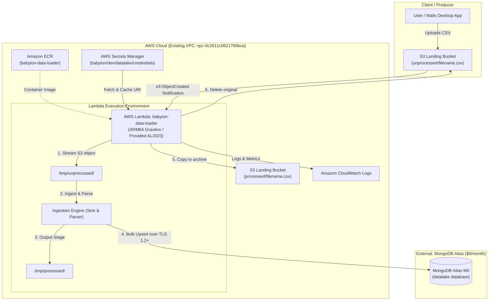
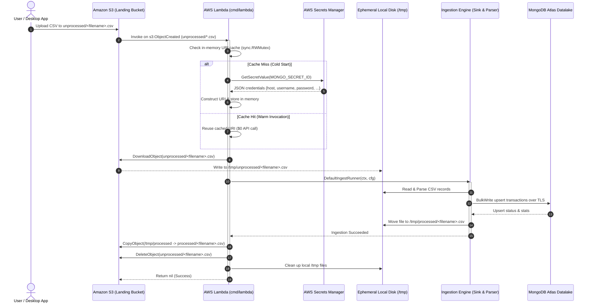

# Architecture Decision Record: Serverless Data Loader Ingestion Pipeline with AWS Lambda, MongoDB Atlas M0, and AWS Secrets Manager

* **Status**: Accepted (Phase 1 Implemented)
* **Author**: Tech Lead (`tech-lead`)
* **Date**: 2026-09-19
* **Project**: [`babylon_deploy`](file:///Users/aponte/personal_workspace/babylon-2.0/babylon_deploy)
* **Target Components**: [`babylon_deploy/terraform`](file:///Users/aponte/personal_workspace/babylon-2.0/babylon_deploy/terraform), [`babylon_data_loader`](file:///Users/aponte/personal_workspace/babylon-2.0/babylon_data_loader)
* **Related Specifications**:
  * [`DATA-LOADER-TF-PHASE1.md`](file:///Users/aponte/personal_workspace/babylon-2.0/agent-docs/DATA-LOADER-TF-PHASE1.md)
  * [`Babylon-Data-Loader-TF-Deploy.md`](file:///Users/aponte/personal_workspace/babylon-2.0/agent-docs/Babylon-Data-Loader-TF-Deploy.md)

---

## 1. Context and Problem Statement

The Babylon ecosystem is migrating its personal finance platform towards cloud-native deployments on AWS, managed declaratively with Terraform. The **Babylon Data Loader** is a core Go-based ingestion engine responsible for processing raw financial transaction CSV statements (from banks, credit cards, and institutions) and upserting normalized documents into a MongoDB datalake collection.

### 1.1 Existing State
* **Legacy Terraform Placeholder**: The existing configuration in [`babylon_deploy/terraform/modules/data-loader`](file:///Users/aponte/personal_workspace/babylon-2.0/babylon_deploy/terraform/modules/data-loader) contained an outdated Aurora PostgreSQL ("alex-aurora") scaffold that did not align with the application's actual data model, which is built natively on MongoDB (`go.mongodb.org/mongo-driver`).
* **Workload Characteristics**: Financial statement ingestion is an event-driven, batch/on-demand workload. Files arrive periodically (e.g., monthly, weekly, or manual uploads), rather than continuously. A 24/7 dedicated server or cluster is idle >99% of the time.
* **Target Infrastructure Constraints**:
  * **Cost Requirement**: Highest priority constraint is to minimize cloud operating costs, targeting a **$0.00 / month baseline**.
  * **VPC Integration**: Existing AWS VPC `vpc-0c2611c0821789bca` in `us-east-1` must be utilized for AWS resources.
  * **Developer Experience**: Local CLI execution (`main.go`), synthetic data generators, and Wails desktop application workflows must remain completely uninterrupted.

---

## 2. Decision Drivers

1. **Zero Baseline Cost**: The infrastructure must not incur baseline monthly fees when idle ($0/mo for compute and database storage).
2. **MongoDB Compatibility**: 100% native MongoDB driver compatibility with zero schema mapping layers or API emulation quirks.
3. **Operational Simplicity**: Fully serverless compute that automatically scales to zero and requires zero OS patching or cluster management.
4. **Security & Least Privilege**:
   * No hardcoded database credentials in Terraform state or environment variables.
   * Secure database credential management via AWS Secrets Manager.
   * Fine-grained IAM policies for S3 and Secrets Manager access.
5. **Clean IaC Modularity**: Foundation resources (VPC, Atlas cluster, Secrets Manager) must be decoupled from application compute modules so services can be created, upgraded, or destroyed independently.
6. **Data Durability**: Raw incoming files must never be discarded without guaranteed processing, verified database persistence, and archiving.

---

## 3. Considered Options and Trade-Off Analysis

### 3.1 Persistence Layer: DocumentDB vs. MongoDB Atlas M0

| Criteria | Option A: Amazon DocumentDB (`db.t3.medium` minimum) | Option B: MongoDB Atlas M0 Free Tier (Selected) |
| :--- | :--- | :--- |
| **Monthly Baseline Cost** | **$57.00 – $72.00 / month** (no free tier for continuous clusters) | **$0.00 / month** (Perpetual Free Tier) |
| **Storage & RAM** | 10 GB storage, 4 GB RAM | 512 MB storage, shared RAM |
| **MongoDB Compatibility** | Partial (API emulation, lacks newer Mongo features) | 100% Native MongoDB (version 7.x / 8.x) |
| **Terraform Automation** | Native `aws_docdb_cluster` | Official `mongodbatlas` Terraform Provider |
| **Network Security** | VPC private subnet endpoints | TLS 1.2+, SCRAM-SHA-256, IP Access List |
| **Decision** | **Rejected** due to prohibitive idle baseline costs | **Selected**: Meets cost ($0) and native compatibility goals |

### 3.2 Compute Pattern: AWS ECS Fargate vs. AWS Lambda (Container Image)

| Criteria | Option A: AWS ECS Fargate (Persistent Task) | Option B: AWS Lambda Container (ARM64) (Selected) |
| :--- | :--- | :--- |
| **Monthly Baseline Cost** | **$9.00 – $15.00 / month** minimum (continuous task) | **$0.00 / month** (1M free requests + 3.2M Graviton sec/mo) |
| **Execution Model** | Continuous listener / polling service | Event-driven trigger on `s3:ObjectCreated` |
| **Architecture** | x86_64 or ARM64 Fargate task | ARM64 Graviton2 (`public.ecr.aws/lambda/provided:al2023`) |
| **Scaling** | Scale-down to 0 requires complex orchestration | Native scale-to-zero; instant sub-second invocation |
| **Max Execution Time** | Unlimited | 15 minutes (CSV ingestion takes 2–15 seconds) |
| **Decision** | **Rejected** due to non-zero idle cost | **Selected**: Perfect match for periodic event-driven CSV batch |

### 3.3 Database Credential Management: Plaintext Env vs. AWS Secrets Manager

| Criteria | Option A: Plaintext Environment Variables | Option B: AWS Secrets Manager with In-Memory Caching (Selected) |
| :--- | :--- | :--- |
| **Security** | High risk: plain URI exposed in Lambda console and TF state | Secure: credentials encrypted at rest with AWS KMS |
| **API Cost Risk** | $0 API calls | Secrets Manager charges $0.05 per 10,000 API requests |
| **Mitigation** | N/A | **Client-side thread-safe in-memory caching (`sync.RWMutex`)** resolves cost; fetched once per warm container lifecycle |
| **Local Dev Support** | Manual env vars | Seamless fallback to local `MONGO_URI` if secret ID unset |
| **Decision** | **Rejected** (violates security standard) | **Selected**: Production security with zero cost overhead |

---

## 4. Decision Outcome

We have decided to implement an **Event-Driven Serverless Ingestion Pipeline** combining:

1. **MongoDB Atlas M0 Free Tier**: Hosted on AWS `US_EAST_1`, providing native MongoDB datalake storage at $0.00/month.
2. **AWS Secrets Manager**: Storing structured JSON database credentials (`babylon/${environment}/datalake/credentials`) with in-memory caching in the Go application.
3. **Amazon S3 Landing Bucket**: Staging raw incoming files under `unprocessed/` and auto-archiving to `processed/`.
4. **AWS Lambda Container on ARM64 Graviton**: Executing the compiled Go ingestion engine in a minimal container (`public.ecr.aws/lambda/provided:al2023`) triggered directly by `s3:ObjectCreated` notifications.
5. **Decoupled Terraform Modular Architecture**: Structuring IaC into clear phases to manage lifecycle boundaries cleanly.

---

## 5. Architectural Design and Component Specifications

### 5.1 System Architecture Diagram

### 5.2 End-to-End Ingestion Lifecycle Flow

---

## 6. Implementation Breakdown & Current Status

### 6.1 Phase 1 (Completed): Application Adapter, Secrets, & Infrastructure Foundations

#### A. Application Implementation ([`babylon_data_loader`](file:///Users/aponte/personal_workspace/babylon-2.0/babylon_data_loader) — Branch `feature/lambda-adapter`)
1. **AWS SDK v2 Dependencies**: Added `aws-lambda-go`, `aws-sdk-go-v2`, `service/s3`, `service/secretsmanager`, and vendored cleanly via `go mod tidy && go mod vendor`.
2. **Secrets Manager Caching Layer** ([`config/secrets.go`](file:///Users/aponte/personal_workspace/babylon-2.0/babylon_data_loader/config/secrets.go)):
   * [`MongoCredentials`](file:///Users/aponte/personal_workspace/babylon-2.0/babylon_data_loader/config/secrets.go#L24-L33): Unmarshals structured JSON credentials or direct URIs.
   * [`GetMongoURI`](file:///Users/aponte/personal_workspace/babylon-2.0/babylon_data_loader/config/secrets.go#L48-L82): Resolves URI with thread-safe `sync.RWMutex` cache, Secrets Manager retrieval, and `MONGO_URI` environment variable fallback.
   * Covered by 14 unit tests in [`config/secrets_test.go`](file:///Users/aponte/personal_workspace/babylon-2.0/babylon_data_loader/config/secrets_test.go).
3. **S3 Storage Client** ([`storage/s3.go`](file:///Users/aponte/personal_workspace/babylon-2.0/babylon_data_loader/storage/s3.go)):
   * Methods: [`Download`](file:///Users/aponte/personal_workspace/babylon-2.0/babylon_data_loader/storage/s3.go#L46-L79), [`Copy`](file:///Users/aponte/personal_workspace/babylon-2.0/babylon_data_loader/storage/s3.go#L82-L104), [`Delete`](file:///Users/aponte/personal_workspace/babylon-2.0/babylon_data_loader/storage/s3.go#L106-L121) with error wrapping and secure directory permissions (`0750`).
   * Covered by unit tests in [`storage/s3_test.go`](file:///Users/aponte/personal_workspace/babylon-2.0/babylon_data_loader/storage/s3_test.go).
4. **Lambda Entrypoint** ([`cmd/lambda/main.go`](file:///Users/aponte/personal_workspace/babylon-2.0/babylon_data_loader/cmd/lambda/main.go)):
   * S3 event handler filtering `.csv` files under `unprocessed/`.
   * Ephemeral `/tmp` staging, core ingestion invocation via [`DefaultIngestRunner`](file:///Users/aponte/personal_workspace/babylon-2.0/babylon_data_loader/cmd/lambda/main.go#L77-L106), S3 archive copying, source deletion, and deferred cleanup.
   * 11 unit tests in [`cmd/lambda/main_test.go`](file:///Users/aponte/personal_workspace/babylon-2.0/babylon_data_loader/cmd/lambda/main_test.go).
5. **Container Packaging & Makefile**:
   * [`Dockerfile.lambda`](file:///Users/aponte/personal_workspace/babylon-2.0/babylon_data_loader/Dockerfile.lambda): Multi-stage Linux ARM64 Graviton build targeting `public.ecr.aws/lambda/provided:al2023`.
   * [`makefile`](file:///Users/aponte/personal_workspace/babylon-2.0/babylon_data_loader/makefile): Added `build-lambda`, `docker-build-lambda`, and `test-lambda`.
6. **Quality Gate Verification**:
   * `make check-quality`: **Passed (0 issues)** across `golangci-lint`, `goimports`, `gofumpt`, `go vet`.
   * `go test -v -race ./...`: **Passed (100%)** with zero data races.

#### B. Infrastructure Foundations ([`babylon_deploy`](file:///Users/aponte/personal_workspace/babylon-2.0/babylon_deploy) — Branch `setup-terraform`)
1. **Root Variable Definitions** ([`terraform/variables.tf`](file:///Users/aponte/personal_workspace/babylon-2.0/babylon_deploy/terraform/variables.tf)): Added `vpc_id` (default `"vpc-0c2611c0821789bca"`), `environment` (default `"dev"`), `mongodbatlas_public_key`, `mongodbatlas_private_key`, `mongodbatlas_org_id`, and `atlas_region`.
2. **Variable Configuration Example** ([`terraform/terraform.tfvars.example`](file:///Users/aponte/personal_workspace/babylon-2.0/babylon_deploy/terraform/terraform.tfvars.example)): Created template for secure local configuration.
3. **Outputs & Phase Contracts** ([`terraform/outputs.tf`](file:///Users/aponte/personal_workspace/babylon-2.0/babylon_deploy/terraform/outputs.tf)): Exported foundation attributes and documented outputs for subsequent phases.
4. **Code Formatting**: Verified with `terraform fmt -check -recursive`.

---

### 6.2 Downstream Roadmap

* **Phase 2: Datalake & Secrets Management Module**
  * Configure `mongodbatlas` Terraform provider in [`babylon_deploy/terraform`](file:///Users/aponte/personal_workspace/babylon-2.0/babylon_deploy/terraform).
  * Provision MongoDB Atlas Project, M0 cluster in AWS `US_EAST_1`, database user with readWrite privileges, and IP access list.
  * Provision AWS Secrets Manager secret (`babylon/${environment}/datalake/credentials`) storing the structured connection URI.
* **Phase 3: S3 Landing Bucket & Lambda Compute Module**
  * Provision private S3 landing bucket with server-side encryption (SSE-S3) and public access block.
  * Provision Amazon ECR repository for `babylon-data-loader` container images.
  * Provision ARM64 Graviton Lambda function with least-privilege IAM role (S3 read/write, Secrets Manager read, CloudWatch Logs).
* **Phase 4: Integration, Notification Triggers, & Runbook**
  * Configure S3 bucket notification triggering Lambda on `s3:ObjectCreated` with prefix `unprocessed/` and suffix `.csv`.
  * Validate end-to-end ingestion: upload sample CSV -> Lambda execution -> MongoDB Atlas verification -> S3 archive verification.
  * Publish operational runbook in `docs/runbooks/`.

---

## 7. Consequences and Mitigations

### 7.1 Positive Consequences
* **Zero Idle Cost**: Compute scales to absolute zero when no statements are arriving; MongoDB Atlas M0 is $0.00/month. Total baseline infrastructure cost is **$0.00 / month**.
* **High Performance**: Native Go compiled binary on Graviton ARM64 executes full batch CSV statements in sub-second to low-single-digit seconds.
* **Robust Security**: Credentials rotated in Secrets Manager without redeploying code; zero credentials committed to Git.
* **Zero Regression**: Local CLI and Wails desktop application continue running locally against local or remote Mongo instances without alteration.

### 7.2 Constraints & Mitigations

| Constraint / Risk | Impact | Mitigation Strategy |
| :--- | :--- | :--- |
| **Atlas M0 512 MB Storage Cap** | M0 cluster can fill up over extended multi-year use | Ingestion engine only stores normalized financial transactions. A data archival policy can export historical years to S3 Glacier if data approaches 350 MB. |
| **No VPC Peering on Atlas M0** | Traffic to Atlas traverses public Internet | Encrypted in-transit using TLS 1.2+ with SCRAM-SHA-256 authentication. Atlas IP Access List restricted to specific authorized CIDRs / NAT gateway. |
| **Lambda 15-Minute Timeout** | Extremely massive CSVs could timeout | Average statement has <5,000 rows, taking ~1.5s. Batch processing uses bulk writes (`repo.BulkUpsertTransactions`) with 1,000-row chunks. |
| **Cold Starts** | Initial invocation latency of ~800ms–1.5s | Financial ingestion is asynchronous batch processing; sub-second cold start overhead has zero user impact. |
| **Secrets Manager API Cost** | $0.05 per 10k requests if polled every run | Thread-safe in-memory cache (`sync.RWMutex`) reuses credentials across warm container invocations, reducing API calls by >99%. |

---

## 8. Compliance and Git Safety Rule

In adherence with system guidelines, **all changes made in Phase 1 remain uncommitted** in working copies across both repositories to enable thorough human review before code is merged into trunk branches.
